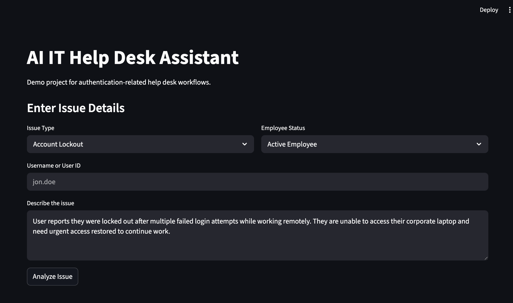
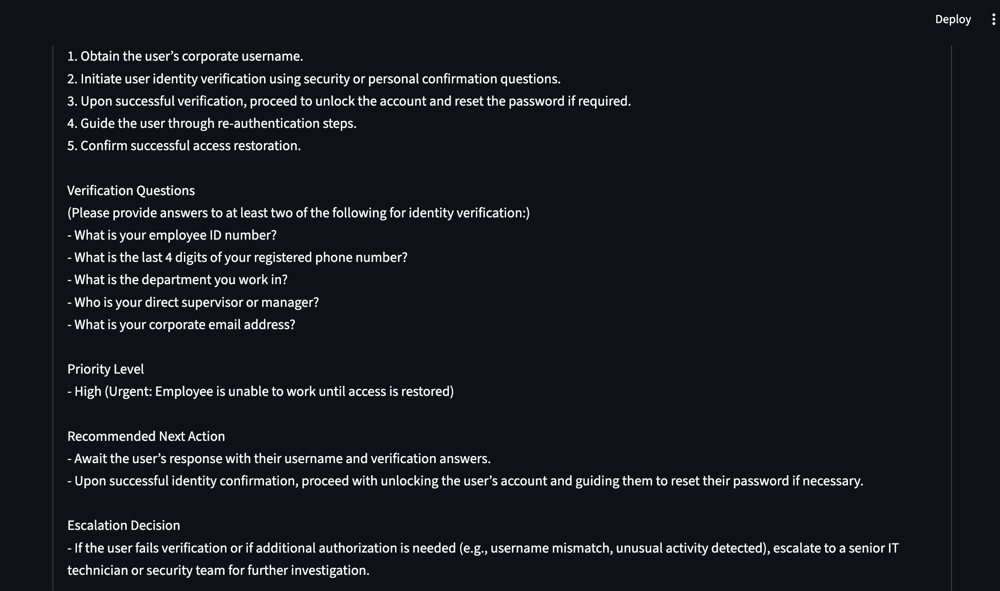

# AI IT Help Desk Assistant

A Streamlit-based AI help desk assistant that simulates real-world IT authentication workflows such as account lockouts, password resets, identity verification, and escalation decisions.

---

## 🚀 Project Overview

This project demonstrates how AI can assist IT support teams by analyzing authentication-related issues and generating structured responses.

The system simulates a corporate help desk environment where:

- Users report login or access issues  
- The AI analyzes the situation  
- The system generates structured IT responses  
- Security and escalation decisions are included  

---

## 🧠 Features

- AI-powered issue analysis  
- Account lockout & password reset workflows  
- Identity verification questions  
- Priority classification  
- Escalation decision logic  
- Structured IT response output  

---

## 🛠️ Tech Stack

- Python  
- Streamlit  
- OpenAI API  
- Prompt Engineering  

---

## 📸 Screenshots

### Input Screen


### Analysis Results


### Decision Summary


---

## ▶️ How to Run Locally

```bash
pip install -r requirements.txt
export OPENAI_API_KEY="your_api_key_here"
streamlit run app.py
